# Задание 1

#### *Linux* - Выполнить в командной строке

-----

Подключаемся по SSH к виртуальной машине

```
ssh -p 8022 rus@localhost
вводим пароль
```
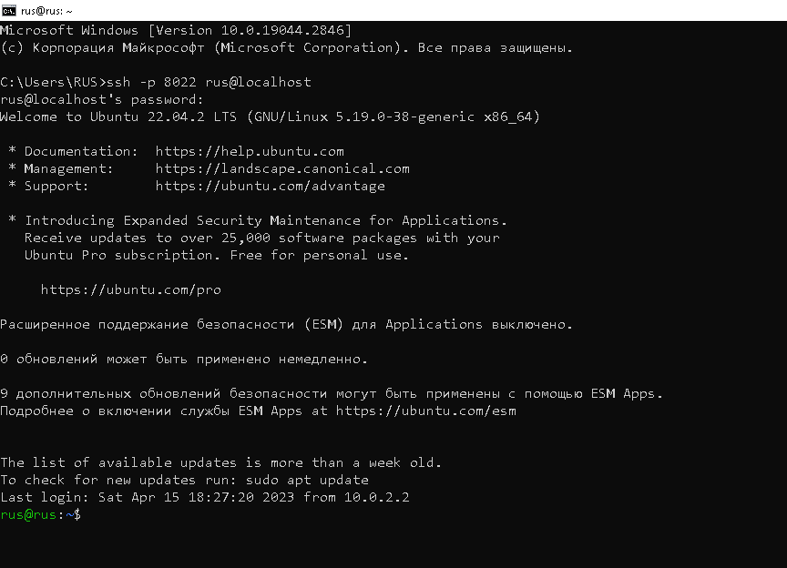

-----

1) Используйте команды операционной системы Linux и создайте две новых директории – «Игрушки для школьников» и «Игрушки для дошколят»

```
mkdir 'Игрушки для школьников'
mkdir 'Игрушки для дошколят'
```
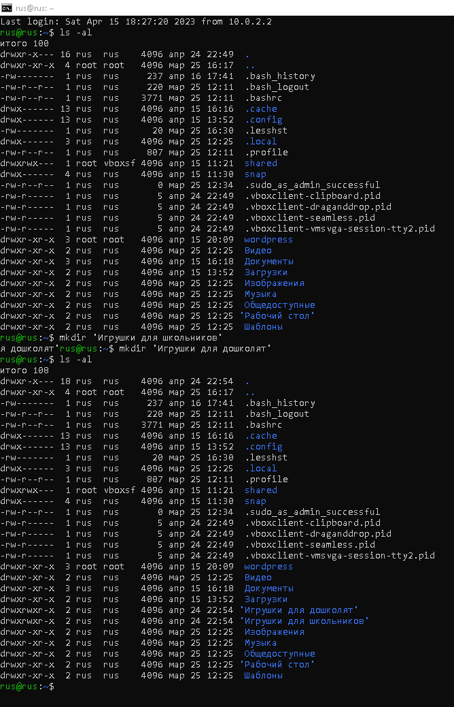

-----

2) Создайте в директории «Игрушки для школьников» текстовые файлы - «Роботы», «Конструктор», «Настольные игры»

```
cd Игрушки\ для\ школьников/
touch Роботы.txt
touch Конструктор.txt
touch 'Настольные игры'.txt
```
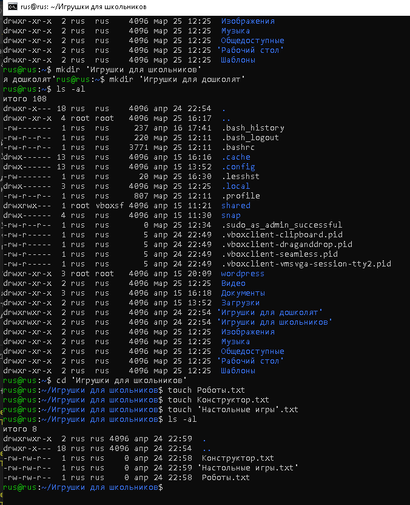

-----

3) Создайте в директории «Игрушки для дошколят» текстовые файлы «Мягкие игрушки», «Куклы», «Машинки»

```
cd ..
cd Игрушки\ для\ дошколят/
touch 'Мягкие игрушки'.txt
touch 'Куклы'.txt
touch 'Машинки'.txt
```
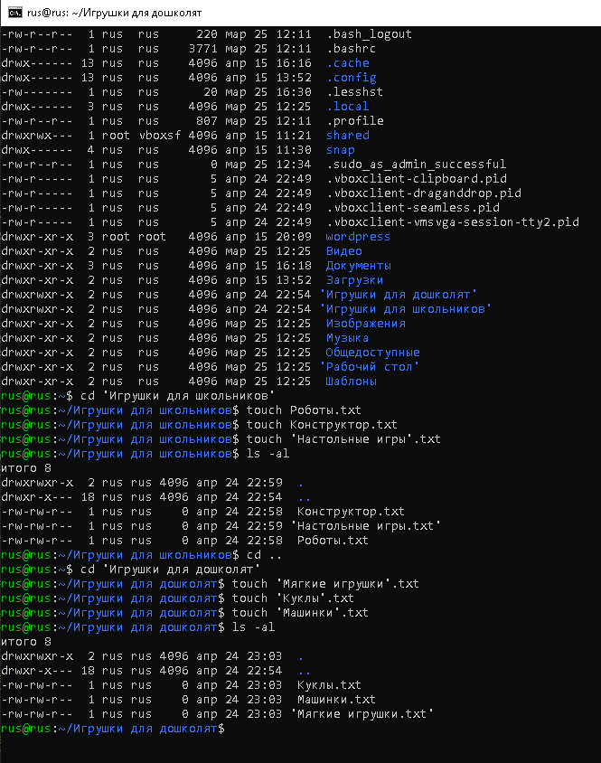

-----

4) Объединить 2 директории в одну «Имя Игрушки»

```
cd ..
mkdir 'Имя игрушки'
cp -r /home/rus/'Игрушки для школьников'/* /home/rus/'Имя игрушки'
cp -r /home/rus/'Игрушки для дошколят'/* /home/rus/'Имя игрушки'
rm -r 'Игрушки для школьников'
rm -r 'Игрушки для дошколят'
```
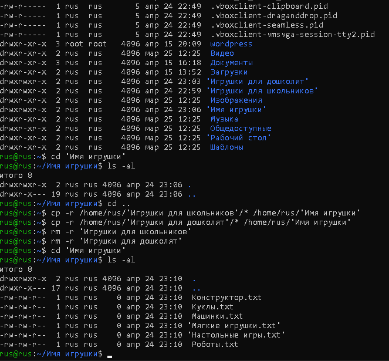

-----

5) Переименовать директорию «Имя Игрушки» в «Игрушки»

```
mv ~/'Имя игрушки' ~/Игрушки
```
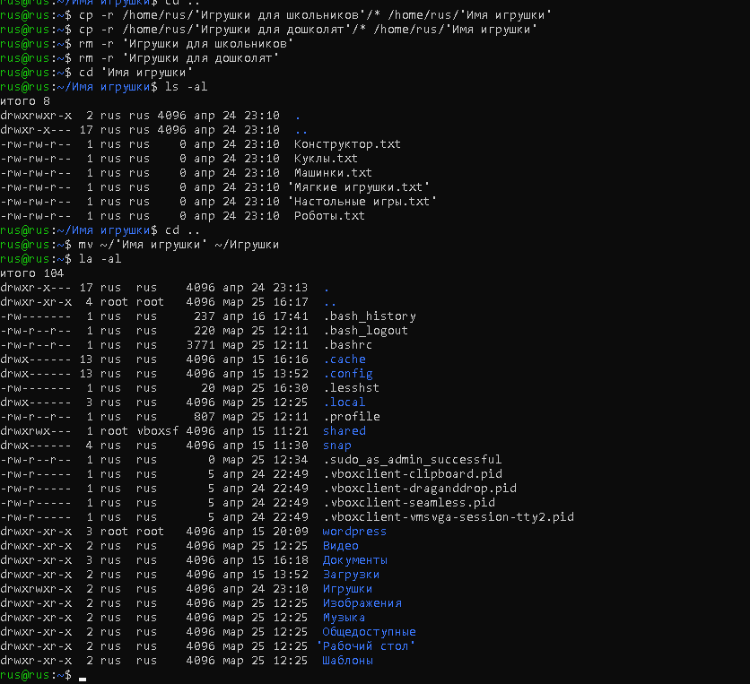

-----

6) Просмотреть содержимое каталога «Игрушки».

```
cd 'Игрушки'
ls -al
```
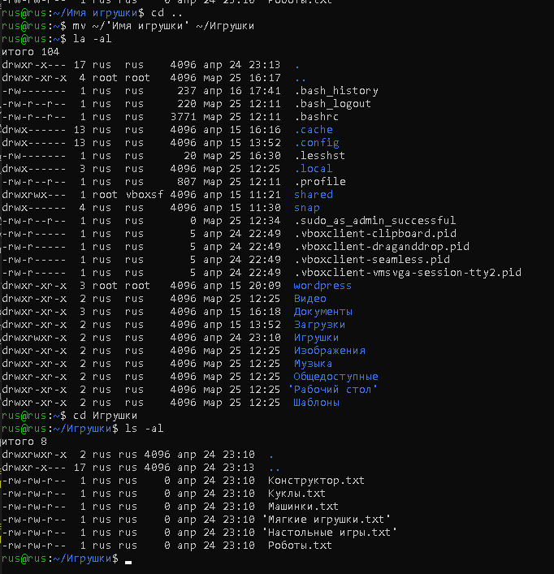

-----

7) Установить и удалить snap-пакет. (Любой, какой хотите)

```
sudo snap list
snap search gimp
sudo snap install gimp
sudo snap list
sudo snap remove gimp
sudo snap list
```
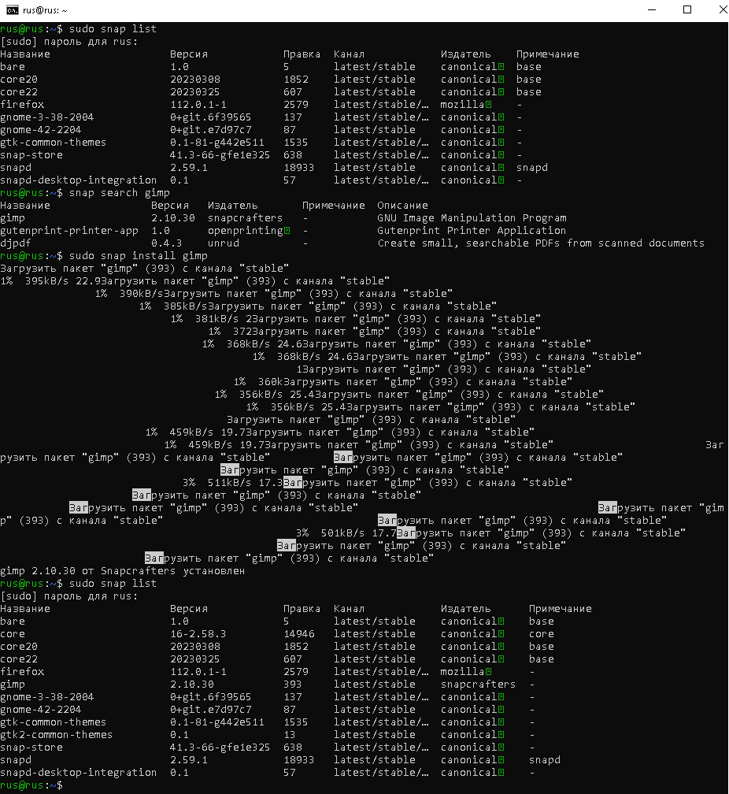

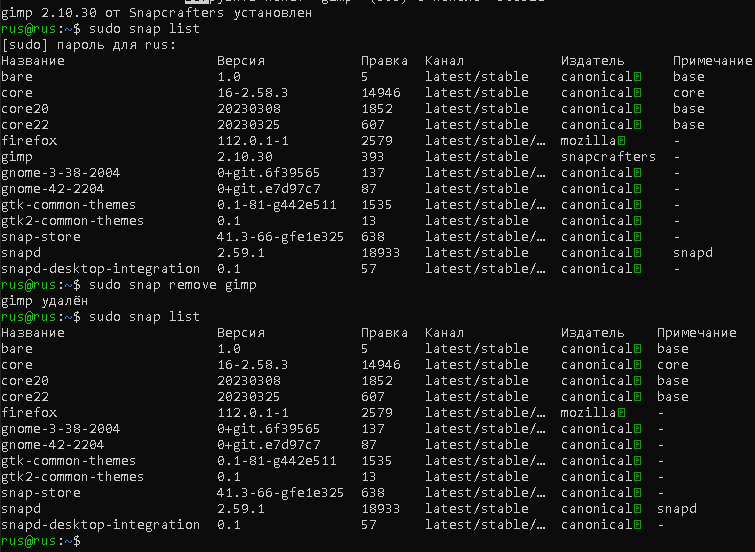

-----

8) Добавить произвольную задачу для выполнения каждые 3 минуты (Например, запись в текстовый файл чего-то или копирование из каталога А в каталог Б).

```
crontab -e
*/3 * * * * echo 'Очередная новая игрушка' >> /home/testuser/Игрушки/Куклы.txt
```
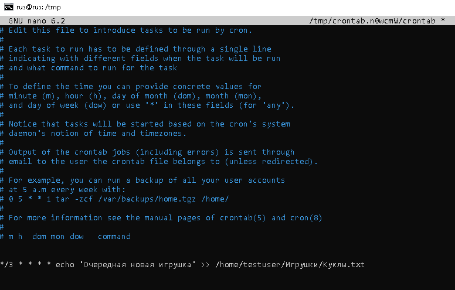

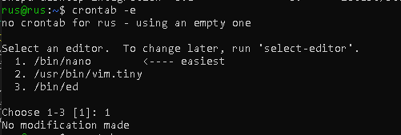

-----
